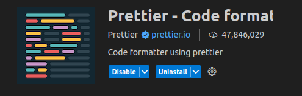
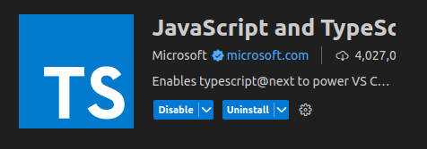

# Hello, Dumbways Addict! 

Ini adalah sumber belajar di bootcamp dumbways stage 2 online :D

## Persiapan
Sebelum memulai perjalanan kita di dunia programming yang lebih advance lagi, aku harap teman-teman sudah mempersiapkan beberapa hal di komputer atau laptop kesayangan kamu ya!

## Internet 

Ya iya dong, wajib hehe

## VSCode

Untuk kode editor, samain saja ya biar mudah nantinya, kecuali kamu pro :D

Link : https://code.visualstudio.com/download

### Extension VSCode yang digunakan meliputi : 

#### Prettier

Link  : https://marketplace.visualstudio.com/items?itemName=esbenp.prettier-vscode

#### JavaScript and TypeScript

Link : https://marketplace.visualstudio.com/items?itemName=ms-vscode.vscode-typescript-next

## Node JS

Link : https://nodejs.org/en/download/package-manager

## PostgreSQL

Link : https://www.postgresql.org/download/

