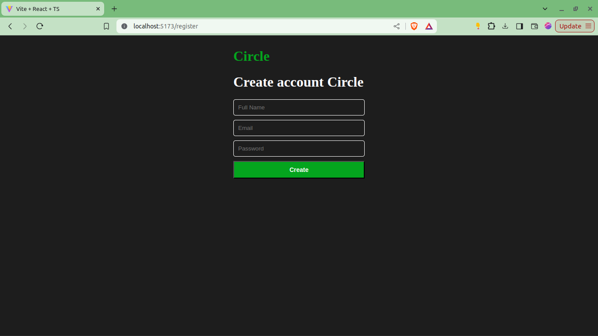

## Advanced React

### 1. Context API untuk State Global

Context API adalah solusi bawaan dari React untuk mengelola state global. Context API memungkinkan kamu untuk membuat context (wadah) yang dapat digunakan untuk menyimpan state global dan membagikannya ke seluruh komponen di dalam context tanpa harus mengoper props secara manual.

Berikut adalah perbandingan antara mengoper props secara manual dengan menggunakan context:


#### Contoh Pembuatan:

Pertama, buatlah context (wadah) untuk data user yang login ke aplikasi:

```jsx
// src/context/auth.tsx

import { createContext, useState } from "react";
import { User } from "../types/user";

interface AuthContextType {
  user: User;
  setUser: React.Dispatch<React.SetStateAction<User>>;
}

export const AuthContext = createContext<AuthContextType>(
  {} as AuthContextType
);

export const AuthProvider = ({ children }: { children: React.ReactNode }) => {
  const [user, setUser] = useState<User>({} as User);

  return (
    <AuthContext.Provider value={{ user, setUser }}>
      {children}
    </AuthContext.Provider>
  );
};
```

#### Tipe `user`:

```jsx
// src/types/user.ts

export type User = {
  id: string,
  fullName: string,
  email: string,
}
```

Kemudian, pasang provider-nya di parent dari context tersebut:

```jsx
// src/routes/app/home.tsx

import { AuthProvider } from "../../context/auth";
import { Feeds } from "../../features/home/components/feeds";

export default function HomeRoute() {
  return (
    <AuthProvider>
      <Feeds />
    </AuthProvider>
  );
}
```

#### Contoh Penggunaan:

```jsx
// src/features/home/components/feeds.tsx

import { useContext } from "react";
import { AuthContext } from "../../../context/auth";

export function Feeds() {
  const { user, setUser } = useContext(AuthContext);
  return (
    <button
      style={{ backgroundColor: "white" }}
      onClick={() => setUser({ ...user, email: "surya@gmail.com" })}
    >
      Login
    </button>
  );
}
```

**Catatan:** Ini adalah contoh penggunaan sederhana.

Namun, jika state menjadi lebih kompleks dan banyak, kamu dapat memodifikasinya seperti berikut:

```jsx
// src/context/auth.tsx

import React, { createContext, ReactNode, useReducer } from "react";
import { User } from "../types/user";

type AuthState = {
  user: User;
};

type AuthAction = { type: "SET_USER"; payload: User } | { type: "CLEAR_USER" };

const initialState: AuthState = {} as AuthState;

function authReducer(state: AuthState, action: AuthAction): AuthState {
  switch (action.type) {
    case "SET_USER":
      return { user: action.payload };
    case "CLEAR_USER":
      return { user: {} as User };
    default:
      return state;
  }
}

interface AuthContextType {
  state: AuthState;
  dispatch: React.Dispatch<AuthAction>;
}

export const AuthContext = createContext<AuthContextType>(
  {} as AuthContextType
);

export const AuthProvider = ({ children }: { children: ReactNode }) => {
  const [state, dispatch] = useReducer(authReducer, initialState);

  return (
    <AuthContext.Provider value={{ state, dispatch }}>
      {children}
    </AuthContext.Provider>
  );
};
```

**Catatan:** Meskipun sedikit lebih panjang, jika state semakin banyak, cara ini akan lebih mudah di-maintain dan lebih rapi ke depannya.

**Sesuaikan dengan kebutuhan kamu.**

Untuk penggunaan context yang baru, kurang lebih bisa seperti ini:

```jsx
// src/features/home/components/feeds.tsx

import { useContext } from "react";
import { AuthContext } from "../../../context/auth";

export function Feeds() {
  const { dispatch } = useContext(AuthContext);

  return (
    <button
      style={{ backgroundColor: "white" }}
      onClick={() =>
        dispatch({
          type: "SET_USER",
          payload: {
            id: "123",
            email: "mantap@gmail.com",
            fullName: "mantap",
          },
        })
      }
    >
      Login
    </button>
  );
}
```

Tambahkan komponen `RightPanel` di `home.tsx`:

```jsx
// src/routes/app/home.tsx

import { AuthProvider } from "../../context/auth";
import { Feeds } from "../../features/home/components/feeds";
import RightPanel from "../../features/home/components/right-panel";

export default function HomeRoute() {
  return (
    <AuthProvider>
      <Feeds />
      <RightPanel />
    </AuthProvider>
  );
}
```

Pada `RightPanel`, coba tampilkan data user yang berada di context sebagai berikut:

```jsx
// src/features/home/components/right-panel.tsx

import { useContext } from "react";
import { AuthContext } from "../../../context/auth";

export default function RightPanel() {
  const { state } = useContext(AuthContext);

  return (
    <div style={{ color: "white" }}>
      <h1>Logged in User</h1>
      <h1>ID: {state.user?.id}</h1>
      <h1>Full Name: {state.user?.fullName}</h1>
      <h1>Email: {state.user?.email}</h1>
    </div>
  );
}
```

### 2. Implementasi React Router untuk Navigasi Dinamis dan SPA

Selama ini kita belum menerapkan sistem routing di aplikasi react kita, padahal penerapan routing adalah salah satu hal paling krusial dalam pembuatan aplikasi website.

Routing secara sederhana akan membuat kita bisa bernavigasi dari satu halaman ke halaman lainnya.

Kita akan menggunakan package bernama [React Router DOM](https://reactrouter.com/en/main)

Selain bisa berpindah halaman, React Router DOM ini juga salah satu (dari sekian) cara untuk melakukan navigasi di react dengan SPA (Single Page Application).

SPA ini simpelnya kita kalau bernavigasi tidak perlu me-refresh keseluruhan halaman, jadi betulan cuma mengubah bagian halaman dan routenya yang dibutuhkan dibalik layar.

Langsung saja ya kita akan install package `react-router-dom` terlebih dahulu. 

```bash
npm install react-router-dom
```

Catatan : kita akan menggunakan react-router-dom versi terbaru, dalam hal ini 6 ke atas (6.^)

Kemudian kita akan buat di file terpisah, kita namakan `AppRouter` :

```jsx
// src/routes/index.tsx

import { createBrowserRouter, RouterProvider } from "react-router-dom";
import HomeRoute from "./app/home";
import LoginRoute from "./auth/login";
import RegisterRoute from "./auth/register";

export function AppRouter() {
  const router = createBrowserRouter([
    {
      path: "/",
      element: <HomeRoute />,
    },
    {
      path: "/login",
      element: <LoginRoute />,
    },
    {
      path: "/register",
      element: <RegisterRoute />,
    },
  ]);

  return <RouterProvider router={router} />;
}
```

Lalu kita panggil di `App.tsx` :

```jsx
import { AppRouter } from "./routes";

function App() {
  return <AppRouter />;
}

export default App;
```

Coba deh, silahkan bernavigasi ke halaman `root` atau tinggal buka `localhost:5173` tanpa route apapun.


Kalau kita ke route `localhost:5173/login` ataupun `localhost:5173/register` akan menyesuaikan juga (mengikut dari element yang kita pasang)




#### Navigasi Melalui Hooks dan Component React Router DOM

React Router DOM juga support dalam melakukan navigasi melalui component yang sudah disediakan yaitu `<Link></Link>` mirip sekali dengan tag `anchor` atau `<a></a>`, contohnya :

```jsx
// src/features/auth/components/login-form.tsx

import { Link } from "react-router-dom";

// ...

<div>
  <p style={{ color: "white" }}>
    Don't have an account yet? <Link to={"/register"}>Create account</Link>
  </p>
</div>

// ...
```

Kita juga bisa menggunakan hooks untuk melakukan navigasi, contohnya :

```jsx
// src/features/auth/components/login-form.tsx

import { useNavigate } from "react-router-dom";

// ...

function LoginForm() {

const navigate = useNavigate()

// ...

<div>
  <p style={{ color: "white" }}>
    Don't have an account yet? <span onClick={() => navigate("/register")}>Create account</span>
  </p>
</div>

// ...
}
```

### 3. Validasi Form dengan React Hook Form

Kita sudah berhasil untuk membuat login form dan register form, hanya saya belum ada validasinya.

Sehingga secara user experience masih kurang, karena user tidak akan tau data yang dibolehkan dan tidak dibolehkan itu apa.

Jadi kita akan menggunakan package bernama :
- `react-hook-form` : digunakan untuk melakukan kontrol terhadap form kita dengan lebih mudah.s 
- `zod` : untuk validasi data.
- `@hookform/resolvers` : untuk menghubungkan `react-hook-form` dengan `zod` sebagai validasi.

Langsung saja kita install di terminal :

```bash
npm install react-hook-form zod @hookform/resolvers
```

Lalu kita akan perbaiki `register-form.tsx` kita supaya memiliki validasi :

```jsx
// src/features/auth/components/register-form.tsx

import { useForm } from "react-hook-form";
import { z } from "zod";
import { zodResolver } from "@hookform/resolvers/zod";

const registerSchema = z.object({
  fullName: z.string().min(1, "Full Name is required"),
  email: z.string().email("Invalid email address"),
  password: z.string().min(6, "Password must be at least 6 characters long"),
});

type RegisterFormInputs = z.infer<typeof registerSchema>;

export function RegisterForm() {
  const {
    register,
    handleSubmit,
    formState: { errors },
  } = useForm<RegisterFormInputs>({
    resolver: zodResolver(registerSchema),
  });

  const onSubmit = (data: RegisterFormInputs) => {
    console.log(data);
  };

  return (
    <form
      onSubmit={handleSubmit(onSubmit)}
      style={{ display: "flex", flexDirection: "column", gap: 10, width: 300 }}
    >
      <input
        {...register("fullName")}
        placeholder="Full Name"
        style={{
          padding: 10,
          color: "white",
          outline: "none",
          border: "1px solid white",
          borderRadius: 5,
        }}
      />
      {errors.fullName && (
        <p style={{ color: "red", margin: 0 }}>{errors.fullName.message}</p>
      )}

      <input
        {...register("email")}
        placeholder="Email"
        style={{
          padding: 10,
          color: "white",
          outline: "none",
          border: "1px solid white",
          borderRadius: 5,
        }}
      />
      {errors.email && (
        <p style={{ color: "red", margin: 0 }}>{errors.email.message}</p>
      )}

      <input
        {...register("password")}
        placeholder="Password"
        type="password"
        style={{
          padding: 10,
          color: "white",
          outline: "none",
          border: "1px solid white",
          borderRadius: 5,
        }}
      />
      {errors.password && (
        <p style={{ color: "red", margin: 0 }}>{errors.password.message}</p>
      )}

      <button
        type="submit"
        style={{
          backgroundColor: "#04A51E",
          padding: 10,
          color: "white",
          fontWeight: "bold",
          fontSize: 14,
        }}
      >
        Create
      </button>
    </form>
  );
}
```

Hasilnya :

