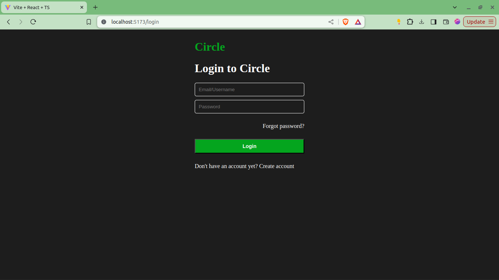

## TypeScript di React

### Setup Proyek React Menggunakan Vite dan TypeScript

#### Setup Proyek

- Untuk memulai, kita akan menggunakan Vite yang merupakan tool build cepat untuk aplikasi modern.

- Jalankan perintah berikut di terminal untuk membuat proyek React baru dengan TypeScript:

  ```bash
  npm create vite@latest
  ```

- Isikan nama projectnya
- Pilih `React`
- Pilih `TypeScript`

- Contohnya sebagai berikut :

  

  ```bash
  cd nama-projectmu
  npm install
  npm run dev
  ```

- Hasilnya :

  

#### Struktur Proyek 

Vite akan menghasilkan struktur proyek dengan file `.tsx` yang sudah siap digunakan dengan TypeScript.

### Penggunaan Tipe TypeScript di Komponen React

#### Definisi Props dengan TypeScript

Kamu bisa mendefinisikan tipe props yang diterima oleh komponen dengan membuat interface atau type.

Contoh:

```jsx
// src/components/Button.tsx
interface ButtonProps {
  label: string;
  onClick?: () => void;
}

export function Button({ onClick, label }: ButtonProps) {
  return <button onClick={onClick}>{label}</button>;
}
```

Challenge : kenapa disini kita membutuhkan `export` ya pada function Button?

Lalu coba, gunakan component tersebut :

```jsx
// src/App.tsx
import { Button } from "./components/Button";

function App() {
  return <Button label="Halo Guys" onClick={() => console.log("test")}/>;
}

export default App;
```
Kamu juga bisa melakukan pengembangan supaya button tersebut lebih customizable, contoh :

```jsx
// src/components/Button.tsx
interface ButtonProps extends React.ButtonHTMLAttributes<HTMLButtonElement> {
  label: string;
}

export function Button({ onClick, label }: ButtonProps) {
  return <button onClick={onClick}>{label}</button>;
}
```

Challenge : coba pikirkan apa bedanya

#### State dengan TypeScript

Untuk mendefinisikan tipe state di komponen React, gunakan `useState` dengan tipe generik.

Contoh:
```jsx
// src/components/Counter.tsx

import { useState } from "react";

export function Counter() {
  const [counter, setCounter] = useState<number>(0);

  function tambah() {
    setCounter(counter + 1);
  }

  function kurang() {
    setCounter(counter - 1);
  }

  return (
    <>
      <h1>{counter}</h1>
      <button onClick={tambah}>Tambah</button>
      <button onClick={kurang}>Kurang</button>
    </>
  );
}
```

Lalu kita tes pada `App.tsx` :

```jsx
import { Counter } from "./components/Counter";

function App() {
  return <Counter />;
}

export default App;
```

Hasilnya :


### Props dan State dengan TypeScript, Termasuk Penanganan Tipe Kompleks

#### Props dengan Tipe Kompleks

Props bisa menggunakan tipe kompleks seperti objek atau array, dan TypeScript akan membantu memastikan tipe tersebut konsisten.

Contoh:

```jsx
// src/components/UserList.tsx

interface User {
  id: number;
  name: string;
}

interface UserListProps {
  users: User[];
}

export function UserList({ users }: UserListProps) {
  return (
    <ul>
      {users.map((user) => (
        <li key={user.id}>{user.name}</li>
      ))}
    </ul>
  );
}
```

Lalu kita test :

```jsx
// src/App.tsx

import { UserList } from "./components/UserList";

function App() {
  return (
    <UserList
      users={[
        {
          id: 1,
          name: "surya",
        },
        {
          id: 2,
          name: "elz",
        },
      ]}
    />
  );
}

export default App;
```

Hasilnya :


#### State untuk Form Handling

Kamu juga bisa menggunakan objek sebagai state dan TypeScript akan memeriksa tipe dari setiap properti.

Contoh:

```jsx
// src/components/Form.tsx

import { useState } from "react";

interface FormState {
  username: string;
  age: number;
}

export function Form() {
  const [formState, setFormState] = useState<FormState>({
    username: "",
    age: 0,
  });

  function handleChange(e: React.ChangeEvent<HTMLInputElement>) {
    console.log(e.target.name, e.target.value);

    setFormState({
      ...formState,
      [e.target.name]: e.target.value,
    });
  }

  function handleSubmit(e: React.FormEvent) {
    e.preventDefault();

    alert(`Halo nama saya : ${formState.username}`);
    alert(`Umur saya : ${formState.age}`);
  }

  return (
    <form onSubmit={handleSubmit}>
      <input
        name="username"
        onChange={handleChange}
        type="text"
        placeholder="Masukkan username..."
      />
      <input
        name="age"
        onChange={handleChange}
        type="number"
        placeholder="Masukkan umur..."
      />
      <button type="submit">Submit</button>
    </form>
  );
}
```

Udah mulai ngerasa kompleks? hehe.

Hasilnya:


### Custom Hooks dengan TypeScript

Simpelnya, kalau kamu mau membuat sebuah logic custom dan juga ingin memanfaatkan hooks bawaan dari react seperti `useState`, `useEffect`, dan `useContext`, dll di dalamnya maka custom hooks adalah jawabannya.

Contoh:

```jsx
// src/hooks/useFetchData.tsx

export function useFetchData<T>(url: string): {
  data: T | null;
  error: string | null;
} {
  const [data, setData] = useState<T | null>(null);
  const [error, setError] = useState<string | null>(null);

  useEffect(() => {
    fetch(url)
      .then((response) => response.json())
      .then(setData)
      .catch(setError);
  }, [url]);

  return { data, error };
}
```

Contoh penggunaan :

```jsx
interface User {
  id: number;
  name: string;
  username: string;
}

function App() {
  const { data, error } = useFetchData<User>(
    `https://jsonplaceholder.typicode.com/users`
  );

  if (error) {
    return <>{JSON.stringify(error)}</>;
  }

  return <>{JSON.stringify(data)}</>;
}

export default App;
```

Dengan menggunakan TypeScript di React, kode yang dihasilkan akan lebih aman dan mudah untuk di-maintain, serta mengurangi risiko bug.
