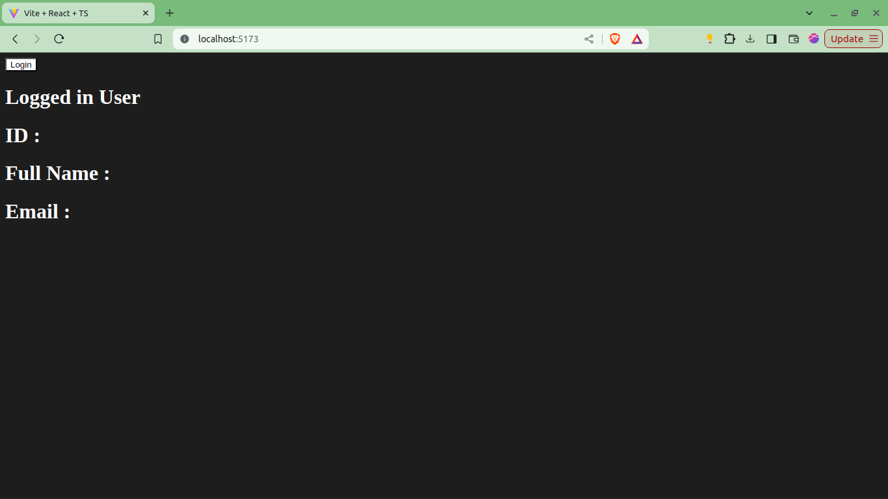

## Pengenalan TypeScript

### Apa itu TypeScript?

TypeScript adalah bahasa pemrograman berbasis JavaScript yang menambahkan fitur tipe data statis.

Dengan TypeScript, kamu bisa menangkap kesalahan kode lebih awal, membuat kode lebih mudah dipelihara, dan lebih aman untuk project besar kedepannya.

### Setup Project Typescript

1. Pastikan kamu sudah melakukan instalasi Node.JS ya sebelumnya.

2. Setup project node.js dengan perintah di terminal :

```bash
npm init -y
```

3. Instal dependencies typescript dengan perintah di terminal :

```bash
npm install -D typescript
```

Challenge : kenapa installnya ada -D nya coba?

4. Lalu jalankan perintah berikut di terminal :

```bash
npx tsc --init
```

5. Sekarang, bikin file bernama `index.ts` lalu tuliskan code :

```ts
console.log("Hello World");
```

6. Install package yang bernama ts-node juga di terminal :

```bash
npm install -D ts-node
```

7. Sekarang jalankan file typescript-nya dengan menggunakan perintah di terminal :

```bash
ts-node index.ts
```

### Tipe Dasar TypeScript

Pada TypeScript ada beberapa tipe dasar yang wajib kamu ketahui :

#### 1. Primitive Types :

Tipe data dasar seperti `number`, `string`, dan `boolean`. Mirip seperti JavaScript, cuma TypeScript ini bisa memastikan kamu tidak salah tipe.

Misal :

```ts
let age: number = 25;
let name: string = "Naruto";
let isStudent: boolean = true;
```

#### 2. Type Any dan Unknown

Tipe data `any` bisa menampung semua tipe data, tapi biasanya kalau kita menggunakan TypeScript hampir pasti sebaiknya tidak menggunakan `any` ya, sama aja kek JavaScript dong kalau kita buat `any` semua? :D

Menggunakan `unknown` akan lebih aman karena harus jelas tipenya apa nanti

Misal :

```ts
let vAny: any = 10; // bisa memasukkan data apapun ke any
let vUnknown: unknown = 10; // bisa juga memasukkan data apapun seperti any

let s1: string = vAny; // any bisa dimasukkan ke data apapun
let s2: string = vUnknown; // ❌ tidak bisa, karena kita tidak tau ini tipe datanya apa (kecuali kita melakukan type assertion)
let s3: string = vUnkown as string; // ✅ bisa karena kita memberikan kepastian bahwa data ini adalah string, konsepnya bernama type assertion

vAny.method(); // Ok; semuanya bisa dianggap bisa oleh any
vUnknown.method(); // ❌ Tidak ok; kita tidak tau apapun dari variable ini
```

#### 3. Union dan Intersection Types

Union mengizinkan variable memiliki lebih dari satu tipe. Membacanya `ATAU`

Intersection menggabungkan beberapa tipe menjadi satu. Cara bacanya `DAN`

Misal :

```ts
// union

let value: string | number; // string ATAU number
value = "hello"; // valid
value = 42; // valid juga

// intersection

type A = {
  a: string;
};

type B = {
  b: number;
};

let value: A & B; // tipe A DAN tipe B

value = { a: "hello", b: 42 }; // valid
```

Catatan : untuk `type` ini nanti akan kita bahas lebih dalam.

#### 4. Literal Types

Membatasi nilai yang bisa digunakan pada variable dengan menggunakan literal types.

Misal :

```ts
type Direction = "left" | "right";
let direction1: Direction = "kiri"; // ❌ error, Direction bukan tipe string, tapi tipenya ya literally "left" dan "right"
let direction2: Direction = "left"; // ✅
```

Catatan : kalau kamu pakai VSCode, coba teken `CTRL + Spasi` di antara petik (""), akan muncul tuh suggestionnya `"left"` dan `"right"`

#### 5. Enum

Tipe khusus untuk menghimpun nilai konstan dengan nama yang lebih mudah dibaca dan rapih.

Misal :

```ts
enum Color {
  Red,
  Green,
  Blue,
}

let color: Color = Color.Green;

console.log(color); // 1
```

Catatan : Enum ini akan menghasilkan nilai index, sesuai urutannya.

Kalau mau ada isi nilainya yang lain bisa menggunakan assignment `=`, contohnya seperti ini :

```ts
enum Color {
  Red = "Red",
  Green = "Green",
  Blue = "Blue",
}

let color: Color = Color.Green;

console.log(color); // Green
```

### Interfaces dan Type Aliases

#### 1. Interface

Sebuah blueprint berbentuk `object` untuk menentukan properti dan tipe data yang harus dimiliki `object` tersebut.

Misal :

```ts
interface User {
  name: string;
  age: number;
}

let user: User = {
  name: "Sasuke",
  age: 27,
};
```

Challenge : coba deh kamu tidak isi `age`-nya, pasti bakalan jadi merah, nah kalau aku pengin `age`-nya opsional, gimana yaa?

#### 2. Type Aliases

Alternatif dari interface yang lebih fleksibel. Type Aliases bisa digunakan untuk tipe yang sederhana maupun yang kompleks.

Misal :

```ts
type User = {
  name?: string;
  email: string;
  password: string;
};

let user: User = {
  email: "surya@gmail.com",
  password: "xxxx",
};
```

#### Extending Interfaces dan Type Aliases

Kamu bisa melakukan extending / perpanjangan / intersection pada `Type Aliases` maupun `Interfaces`.

Contohnya di Interfaces :

```ts
interface User {
  name?: string;
  email: string;
  password: string;
}

interface Profile {
  image?: string;
  age?: number;
  birthDate?: Date;
  address: string;
};

interface UserProfile extends User, Profile {}
```

Contoh dengan Type Aliases :

```ts
type User = {
  name?: string;
  email: string;
  password: string;
};

type Profile = {
  image?: string;
  age?: number;
  birthDate?: Date;
  address: string;
};

type UserProfile = User & Profile;

let userProfile: UserProfile = {
  name: "surya",
  email: "surya@gmail.com",
  password: "xxxx",
  address: "Depok",
};
```

#### Lalu Perbedaan Interface dan Type Aliases Apa?

Tergantung praktik dan preferensinya, ada beberapa codebase yang menggunakan OOP, maka `interface` lebih cocok.

Tapi kalau menurut penulis pribadi, hampir selalu gunakan `type aliases` saja supaya mudah nantinya.

Tapi ada juga developer yang senangnya selalu gunakan `interface` jika tidak perlu `type aliases`.

Tapi kalau kamu mau lihat perbandingan secara teknisnya sebagai berikut :



Catatan : Praktis mudahnya, tidak usah dihafalkan, gunakan senyaman dan sebutuhnya saja. Yang terpenting adalah buat jadi konsisten / punya prinsip di codebase yang kamu buat, supaya rapih.

### Konfigurasi dan Kompilasi TypeScript

#### Apa itu tsconfig.json?

Simpelnya, file `tsconfig.json` ini digunakan untuk konfigurasi typescript. 

Kamu pengin `"typescript ini membantu kek gimana"` bisa diatur di file ini.

Catatan : lagi-lagi, tidak perlu kamu hafalin semua konfigurasi di `tsconfig.json` ini, ubah sesuai kebutuhan saja. Atau kalau misal ada error, tinggal kamu cari errornya di google "oh disuruh ubah ini di `tsconfig.json`", barulah kamu ubah.

Contoh konfigurasi simpel `tsconfig.json` :

```json
{
  "compilerOptions": {
    "target": "ES6",
    "module": "commonjs",
    "strict": true,
    "outDir": "./dist",
    "rootDir": "./src",
    "esModuleInterop": true
  },
  "include": ["src/**/*.ts"],
  "exclude": ["node_modules"]
}
```

Penjelasan :

**`target`: "ES6"** =>
Menentukan versi JavaScript yang dihasilkan setelah kompilasi. Dalam contoh ini, TypeScript akan menghasilkan kode JavaScript yang sesuai dengan ECMAScript 6 (ES2015). Versi ini mendukung fitur modern seperti arrow functions, let/const, class, dan lainnya.

**`module`: "commonjs"** => Mengatur format module yang digunakan, yaitu CommonJS, yang merupakan standar module system di Node.js. Ini memastikan bahwa kode yang dihasilkan dapat diimpor dan diekspor menggunakan sintaks CommonJS (`require` dan `module.exports`).

**`strict`: true** => Mengaktifkan mode ketat TypeScript, yang memberlakukan serangkaian aturan pengecekan tipe yang lebih ketat.

**`outDir`: "./dist"** => Menentukan direktori output tempat TypeScript akan menyimpan file hasil kompilasi JavaScript.

**`rootDir`: "./src"** => Mengatur direktori root untuk file sumber TypeScript.

**`esModuleInterop`: true** => Dengan pengaturan ini, kamu bisa mengimpor module CommonJS menggunakan sintaks import ES6.

**`include`** => Bagian ini menentukan file dan folder yang harus diikutsertakan dalam proses kompilasi. Pada contoh di atas, TypeScript akan mencari semua file dengan ekstensi `.ts` di dalam folder `src` dan subfolder-nya.

***`exclude`*** => Bagian ini menentukan file atau folder yang akan dikecualikan dari kompilasi. Dalam contoh ini, folder `node_modules` tidak akan dikompilasi, karena berisi dependencies yang tidak perlu dikompilasi ulang.

#### Kompilasi TypeScript ke JavaScript

TypeScript ke JavaScript. Kamu bisa mengatur output dan lokasi file hasil kompilasi di `tsconfig.json`.

Contoh perintah kompilasi:

```bash
npx tsc
```

Disini akan dihasilkan file `index.js` di folder dist (sesuai konfigurasi yang kita buat) 